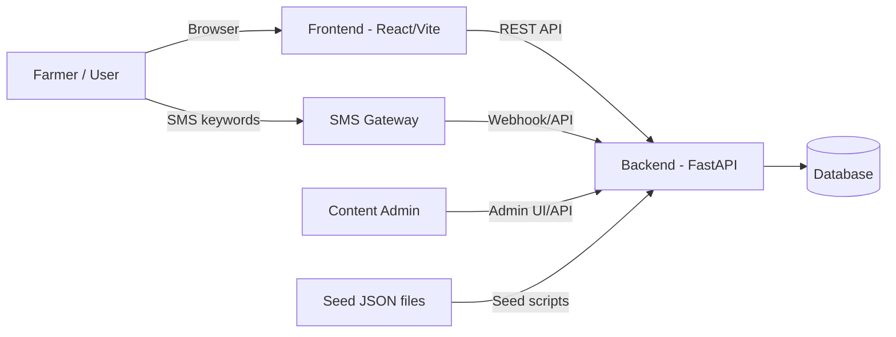

# CARE4ANIMALS

**A Microlearning Platform for Empowering Farmers with Bite-Sized Animal Wellness Knowledge**

CARE4ANIMALS is a multilingual microlearning platform designed to enhance livestock welfare. It provides smallholder farmers in Africa with practical, culturally relevant knowledge through concise educational modules accessible via a mobile web app or low-connectivity SMS services.

---

## 📖 Overview

Smallholder farmers often face barriers to veterinary education due to low literacy, limited internet connectivity, and scarce extension resources. CARE4ANIMALS bridges this gap by delivering short, actionable lessons optimized for both smartphones and feature phones.

### Core Features
* **Hybrid Access:** Mobile-friendly React web app and offline-ready SMS flows.
* **Multilingual Support:** Content available in English (`en`), Luganda (`lg`), and Swahili (`sw`).
* **CMS Workflow:** Integrated admin API/UI for lesson authoring, drafting, and publishing.
* **Research-Driven:** Part of "Theme B" research focusing on changing farmer behaviors toward good welfare for farm animals in Africa.

---

## 🏗️ System Architecture

The system utilizes a modern FastAPI backend and React frontend, with a flexible SQLite/PostgreSQL data layer and SMS gateway integration.



### Repository Structure
```text
care4animals/
├── backend/            # FastAPI source, models, routers, and seed scripts
├── frontend/           # React/Vite/TypeScript frontend
├── docs/               # System documentation & architecture diagrams
├── scripts/            # Root helper scripts (bootstrap & automation)
├── sms-flows/          # SMS/USSD flow assets (RapidPro/Viamo)
└── analytics/          # Analytics processing (Pandas/SciPy/SPSS)
```

---

## 🚀 Quick Start (Recommended)

**Prerequisites:**
* Docker & Docker Compose
* Python 3 (for local bootstrap scripts)

### One-Command Bootstrap
This command builds the environment, starts all services, and automatically seeds and publishes the initial lesson sets (EN/LG/SW):

```bash
./scripts/bootstrap_local_lessons.sh
```

**Endpoints:**
* **Frontend:** [http://localhost:5173](http://localhost:5173)
* **Backend API:** [http://localhost:8000](http://localhost:8000)

---

## 🛠️ Manual Setup

If you prefer to run steps individually:

1. **Start Services:**
   ```bash
   docker compose up --build -d
   ```

2. **Seed and Publish Lessons:**
   ```bash
   # Seed languages
   python3 backend/scripts/seed_lessons_via_api.py --base-url http://127.0.0.1:8000 --file backend/seed/lessons_en.json
   python3 backend/scripts/seed_lessons_via_api.py --base-url http://127.0.0.1:8000 --file backend/seed/lessons_lg.json
   python3 backend/scripts/seed_lessons_via_api.py --base-url http://127.0.0.1:8000 --file backend/seed/lessons_sw.json
   
   # Finalize publication
   python3 backend/scripts/publish_all_lessons.py --base-url http://127.0.0.1:8000
   ```

---

## 📑 CMS to SMS Workflow

1.  **Drafting:** Admin creates a topic and lesson draft in the Admin UI.
2.  **Publishing:** Once finalized, the admin publishes the lesson. Public endpoints **only** expose published content.
3.  **Consumption:** The Web UI fetches lessons based on the user's language.
4.  **SMS Integration:** The SMS flow accepts commands (e.g., `TOPICS`, `LESSONS <topic>`, `LESSON <code>`) and returns plain-text versions of published lessons via webhook.

---

## 💻 Development Notes

* **Database:** In local Docker setups, the backend uses a SQLite file located at `backend/care4animals.db`.
* **Data Persistence:** A standard `git pull` or `docker compose pull` does not include seeded data. You must run the bootstrap or seed scripts on each new machine.
* **State Management:** The frontend language selector dispatches a `c4a:language-changed` event to trigger a global refetch of localized content.

## 📄 License

This project is licensed under the **MIT License**.
